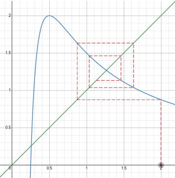
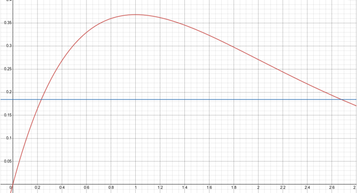

# Метод итераций

**Метод итераций** — один из наиболее продуктивных методов поиска корней уравнений
для нужд школьной физики. С одной стороны его достаточно просто реализовать, с
другой метод универсален (почти).

Рассмотрим произвольное уравнение вида:

$$
F(x) = 0,
$$

и попробуем найти его решения. Для этого заменим это выражение на эквивалентное
(множество решений не должно измениться) следующего вида:

$$
f(x) = x.
$$

Тогда алгоритм, приводящий к решению, выглядит так:

$$
x_{n+1} = f(x_n),
$$

однако возникает сложность: чему равен $ x_1 $? В простом случае первое значение
выбирается близко к предполагаемому значению корня.

### Пример 1

Рассмотрим уравнение:

$$
x^3 - 2x + \frac{1}{2} = 0,
$$

найдем его корни. Этому уравнению эквивалентно такое:

$$
x = \frac{2}{x} - \frac{1}{2x^2}.
$$

Полученный итерационный алгоритм позволяет достаточно быстро получить оценку
корня, так значения $ x $ на 7 и 8 итерации составляют примерно 1.37 и 1.19, при этом
значение корня составляет около 1.27 (при начальном значении $ x_1 = 2 $).

*Рис. 1: Метод итераций*

На практике удобно вычислять такие итерационные схемы с помощью калькулятора
с переменной $ Ans $:

$$
Ans_2 = \frac{2}{Ans_1} - \frac{1}{2Ans_1^2}.
$$

В ходе решения задачи можно столкнуться с затруднением: метод итераций не всегда
сходится. Рассмотрим такое уравнение:

$$
x^6 - 5x - 2 = 0.
$$

Возможны следующие реализации итерационного алгоритма:

$$
x_{n+1} = \frac{x_n^6 - 2}{5},
$$
$$
x_{n+1} = \frac{5}{x_n^4} + \frac{2}{x_n^5},
$$
$$
x_{n+1} = \sqrt[6]{5x_n + 2},
$$
$$
x_{n+1} = \sqrt{\frac{5}{x_n^3} + \frac{2}{x_n^4}}.
$$

Первый алгоритм сможет дать лишь один из двух корней, только если $ x_1 \in [-1, 1] $ (в остальных случаях алгоритм не сойдется). Второй и четвертый разойдутся всегда. Лишь третий покажет хорошую сходимость при почти любом начальном значении (но снова доступен лишь один из двух корней). В этом контексте возникает необходимость в критерии сходимости для итерационного метода. Он формулируется так: итерационный алгоритм сходится для множества значений $ x $, если:

$$
|f'(x)| < 1.
$$

### Пример 2

Найдем ширину функции $ y = xe^{-x} $ на полувысоте.

Сначала найдем максимальное значение функции:

$$
y' = e^{-x} - xe^{-x} = 0.
$$

Это справедливо для $ x = 1 $. То есть максимальное значение функции $ y_{max} = \frac{1}{e} $.

Чтобы найти ширину функции на полувысоте, надо найти решения уравнения
(ожидаем, что решения два):

$$
y = xe^{-x} = \frac{1}{2e}.
$$

Рассмотрим итерационный алгоритм:

$$
x_{n+1} = f(x) = \frac{e^x}{2e}.
$$

Проверим критерий сходимости:

$$
f'(x) = \frac{e^x}{2e},
$$

$ |f'(x)| < 1 $ при $ x < 1 + \ln(2) \approx 1.7 $. Эта граница правее максимума функции, а значит этот алгоритм позволит найти левый корень уравнения (эту границу нужно учесть при
подборе первого $ x $ !!!)

Для правого придется подобрать другой алгоритм, например, такой:

$$
x_{n+1} = \ln(2ex_n);
$$

$$
f'(x) = \frac{1}{x},
$$

$ |f'(x)| < 1 $ при $ x > 1 $. Этот алгоритм пригоден для поиска правого корня уравнения.

Методом итераций получаем два корня: 0.23 и 2.68 (примерно), ширина исходной функции - разность двух корней, она составляет 2.45.

*Рис. 2: График функции $ y = xe^{-x} $ , горизонтальной прямой отмечена полувысота.*
